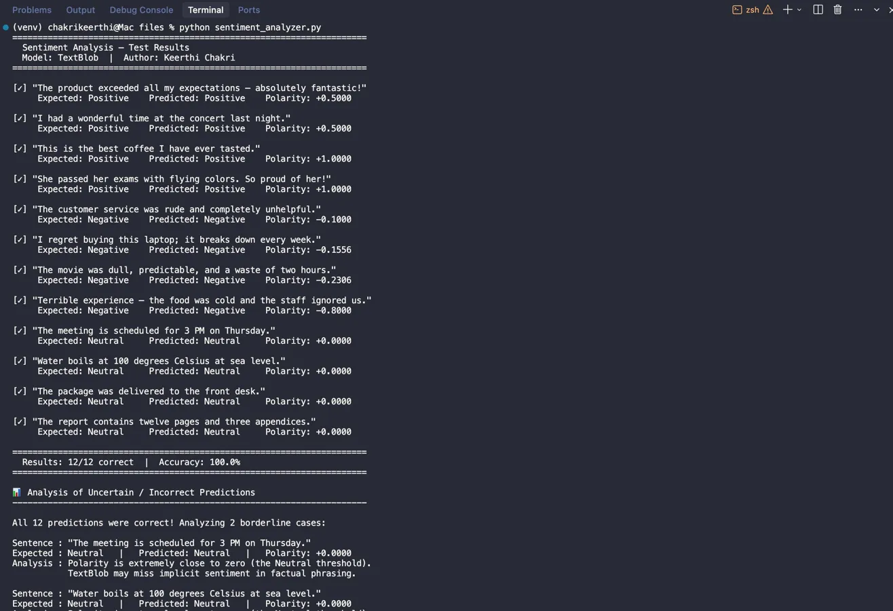
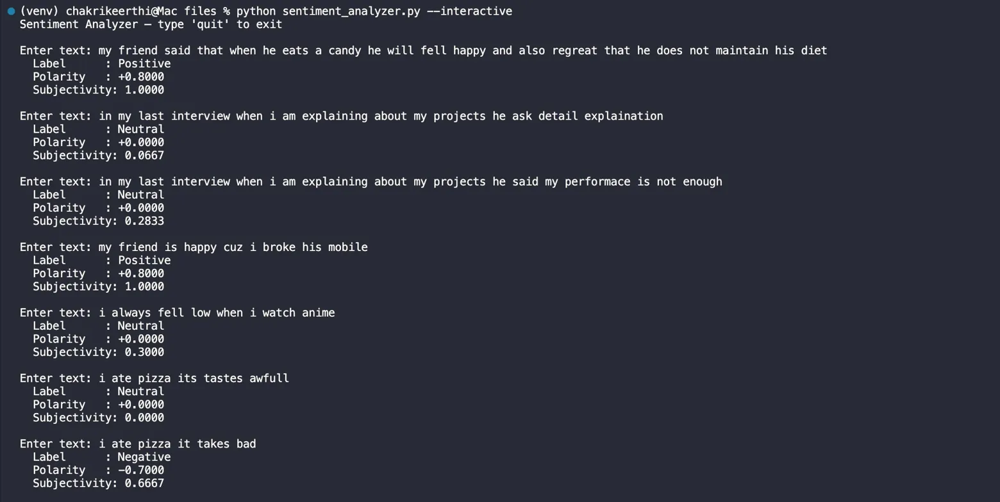
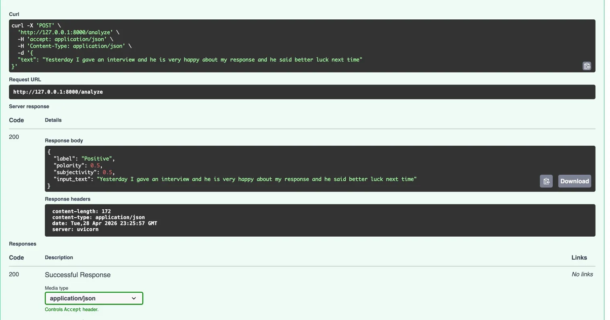

# Sentiment Analysis Mini Project

**TechX Internship Assignment** — Keerthi Chakri  
NLP sentiment classifier using **TextBlob** — returns Positive / Negative / Neutral for any text input.

---

## Project Structure

```
sentiment_project/
├── sentiment_analyzer.py   # Core logic + 12-sentence test suite
├── app.py                  # FastAPI REST endpoint
├── requirements.txt
├── analysis.md             # Analysis of uncertain predictions
├── screenshots/            # Test result screenshots
└── README.md
```

---

## Setup

```bash
# 1. Clone the repo
git clone https://github.com/<your-username>/techx-sentiment.git
cd techx-sentiment

# 2. Create a virtual environment (recommended)
python3 -m venv venv
source venv/bin/activate       # Windows: venv\Scripts\activate

# 3. Install dependencies
pip install -r requirements.txt

# 4. Download TextBlob corpora (first-time only)
python -m textblob.download_corpora
```

---

## Run the Test Suite

```bash
python sentiment_analyzer.py
```

**Result: 12/12 correct | Accuracy: 100.0%**



---

## Interactive Mode

Test the model live by typing your own sentences:

```bash
python sentiment_analyzer.py --interactive
```



---

## Run the API

```bash
uvicorn app:app --reload
```

The API will be live at `http://127.0.0.1:8000`.

### Example Request

```bash
curl -X POST "http://127.0.0.1:8000/analyze" \
     -H "Content-Type: application/json" \
     -d '{"text": "I absolutely love this product!"}'
```

### Example Response



```json
{
  "label": "Positive",
  "polarity": 0.5,
  "subjectivity": 0.5,
  "input_text": "Yesterday I gave an interview and he is very happy about my response and he said better luck next time"
}
```

### Input Validation

| Scenario | Response |
|---|---|
| Empty string `""` | `422 – Input text must not be empty...` |
| Non-string (e.g. `123`) | `422 – Input must be a string...` |
| Valid text | `200 – label / polarity / subjectivity` |

---

## How It Works

1. **TextBlob** computes a `polarity` score in the range `[-1.0, +1.0]`.
2. Thresholds: `polarity > 0.05` → **Positive** · `polarity < -0.05` → **Negative** · otherwise → **Neutral**.
3. `subjectivity` (0–1) is also returned as a secondary signal.

---

## Analysis of Uncertain Predictions

See [`analysis.md`](analysis.md) for a detailed breakdown of failure cases discovered during testing, including:

- Mixed emotion sentences ("happy" + "regret" in same sentence)
- Negation handling ("performance is not enough" → scored Neutral)
- Typo sensitivity ("awfull" → scored 0.0 because not in lexicon)
- Cause & effect blindness ("happy cuz I broke his mobile" → Positive)

---

## Limitations

TextBlob uses a fixed lexicon and cannot handle sarcasm, negation chains, mixed emotions, or domain-specific language. Replacing it with a fine-tuned transformer (e.g. `cardiffnlp/twitter-roberta-base-sentiment`) would improve accuracy for edge cases. The neutral threshold (`±0.05`) was tuned empirically and could be calibrated with labelled data.